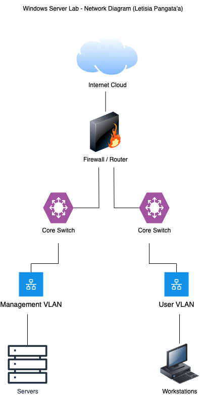

# Windows Server Lab Environment

A Windows Server 2022 lab simulating enterprise-grade Active Directory infrastructure with secure administration and automation.

---

## Project Overview

This lab environment demonstrates best practices in:

- Windows Server 2022 setup and domain configuration
- Active Directory (AD DS) management
- Role-Based Access Control (RBAC)
- Group Policy Object (GPO) automation
- PowerShell-based scripting
- Monitoring and alerting integration
- Disaster recovery simulation

---

## Key Features

- **Automated User Provisioning**: PowerShell scripts to bulk-create users and assign them to OUs and security groups.
- **RBAC Implementation**: Least-privilege model applied using Active Directory groups and delegated permissions.
- **Group Policy Automation**: Scripts to apply security baselines, login restrictions, and software controls.
- **Monitoring Setup**: Event log alerting and email notifications using PowerShell and Task Scheduler.
- **Disaster Recovery Simulation**: Documented restore procedures for AD services and system state backups.

---

## Technologies Used

| Technology          | Purpose                                  |
|---------------------|------------------------------------------|
| Windows Server 2022 | Core lab environment                     |
| Active Directory    | Identity and access control              |
| PowerShell          | Automation and scripting                 |
| Group Policy        | Centralized security and config control  |
| Task Scheduler      | Alerting and monitoring                  |

---

## Architecture Diagram

---

## Folder Structure

- `/scripts/` – PowerShell automation for provisioning, GPO, and monitoring
- `/docs/` – Documentation for disaster recovery and monitoring strategy
- `/architecture/` – Network or system topology diagrams

---

## Security Considerations

This lab is designed with security best practices in mind, including:
- Role-based access
- Scripted user management to reduce error
- Logging and alerting for anomaly detection
- Backup and recovery testing

---

## License

MIT License
